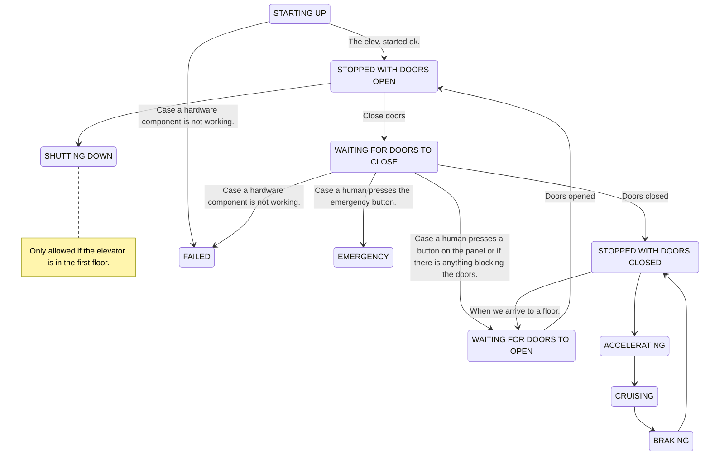

# LIFT / ELEVATOR

Is this a real time system? YES 
What would happen if we don't stop the elevator when it should be stopped? The elevator could crash into the ceiling or the floor. PEOPLE COULD DIE.  For me... that sounds like a HARD real time system.

## Components

- Panel with buttons on each floor
- Panel with buttons inside the elevator
- Motor/ Engine that moves the elevator
- elevator cabin
- doors on each floor
- doors on the elevator cabin
- sensors to detect if the doors are open or closed
- sensors to detect if the elevator is on a floor.. or close to a floor
- sensors to detect if there is something blocking the doors
- Computer 1 that controls the elevator hardware
- Computer 2 that controls the elevator operation

          ENGINE
        |   |   | Floor 3
        |   |   I
        |   |   I      BUTTONS
        |+--+--+I    v
        ||  o  I|------------------------------
        || /|\ I| Floor 2
        || / \ II
        |+-----+I    ^ BUTTONS
        |       I    v
        |       |------------------------------
        |       | Floor 1
        |       I                          O
        |       I    ^ BUTTONS   (1)      /|\
      XX|       I    v                    / \
      XX|       |------------------------------ 
        |       | Floor 0
        |       I
        |       I    ^ BUTTONS
        |       I                                                               KKKK
        |       |------------------------------                                 KKKK    Another computer planning the route of our elevator
                                                                                        This software could  actually be running a machine learning algorithm... learning from the behavior of the users... the time of the day... the day of the week... the weather... etc
                                                                                        the best route for the elevator.

XX  Is a computer controlling the elevator hardware
XX

## Scenario 1:

The elevator is going down from floor 3 to floor 0
A guy press the DOWN button on floor 1, when the cabin is between floor 2 and floor 3
What could be a good decision in this case? Should we stop the elevator when it reaches floor 1? YES
The question here is not only if that is a good decitions... the key is DO WE HAVE TIME ENOUGH TO STOP THE ELEVATOR?
We need to consider:
- The speed of the elevator -> How many meters per second?
- How long can it take to stop the elevator? -> How many meters does it take to stop the elevator?
- How long can it take to send the signal to stop the elevator, from computer 2 to computer 1? -> 
        How many milliseconds does it take to send the signal to stop the elevator?
- The distance from the actual position of the elevator to the floor 1.... right? or.... you do have something to say about this?
    Do I know the actual position of the elevator?
    Do I know if a floor level has been passed?....

    Who is "I" in this case? The computer that controls the elevator hardware? 
                             The computer that plans the route of the elevator? <<<<<< This is the one planning the route... 
                                and this is the one that knows the actual position of the elevator? NOP!
                             Maybe computer1 can send the actual position of the elevator to computer2... 
                             How long does it take to send that information? Probably they are going to be connected through a local network... 
                             And that network is going to have certain latency... In the order of milliseconds...
                             Can we estimate the actual position of the elevator?
                             In order to do that... I am missing some information... the timestamp of the last position update...
                                At time: 10:00:00 the elevator was at floor 3
                                Now, it is 10:00:01... I don't know the actual position of the elevator... but I know that 1 second has passed since the last position update.... and as I know the speed of the elevator... I can estimate the actual position of the elevator.
                                That could be true... 
                                Here we can calculate that the latest known position of the elevator was at floor 3... 
                                and 1 second has passed since that position update...  <<<<< IS THIS TRUE !!!!
                                How do you calculate this? Comparing the actual time to the timestamp recorded in the last position update.
                                    BUT...
                                     who is measuring the actual time? ME: COMPUTER 2
                                     who is recording the timestamp in the last position update? COMPUTER 1
                                    So the previous is true if the clocks of both computers are synchronized.
                                    Because a delay of 1 second in the synchronization of the clocks... would make the previous calculation wrong.
                                    Even 500ms could mean that the elevator is not in floor 2... but in floor 1.

The average speed of an actual elevator is 1 meter per second.

Imagine we have to estimate the actual position of a train... travelling at 300Km/h... and we have a delay of 1 second in the synchronization of the clocks... that would mean that we are estimating the position of the train with an error of 83 meters... and that is a lot of error.

Imagine... computer 2 things we have time enough to stop the elevator... and it sends the signal to computer 1
But... when computer 1 receives the signal, It estimates that it have not time enough to stop the elevator... and it doesn't stop the elevator.
Is that a problem? In this scenario... we did miss the oportunity to stop the elevator... and optimize the route of the elevator.
    Mayybe computer 2 did take too much time to send the signal to computer 1... or to do the calculations to decide if the elevator should be stopped or not.... or...
Can this be considered a failure of the elevator? NO
Was the service degraded? YES
Is it a problem if this kind of things happens twice an hour? NO
Is it a problem if this kind of things happens all the time? YES
    What kind of process is this one? real time process? YES
        Is it a hard real time process? NO
        Firm real time process? NO... does the answer loose value as we get closer to the deadline? NO
        But once we miss the deadline... we can not recover from that...we DONT WANT to process that event anymore... That could actually be dangerous.
        This is a soft real time process.

Within a real time SYSTEM we may have different processes... some of them could be hard real time processes... and some of them could be soft real time processes or firm real time processes.

## Scenario 2:

The elevator is going down from floor 3 to floor 0
A guy press the up button on floor 1

Should we stop the elevator when it reaches floor 1? NO
Imagine... ate the same time (or just a second after that push(1))
another guy presses the down button on floor 2
and another guy presses the up button on floor 0
and another guy presses the down button on floor 3

We need to plan the elevator route... and we need to stop the elevator when it reaches floor 0.

We will have hardware components: Sensors, motors, buttons, doors, a computer (1) that controls the hardware.
But also, we will have software components: The program that controls the elevator. This software will be running on a computer (2).

### 2 different scenarios:

- Computer 1 and 2 are the same computer. The computer that controls the elevator hardware is the same computer that runs the program that controls the elevator operation.
- Computer 1 and 2 are different computers.

Having 1 computer could make the system cheaper, but it could also make it more dangerous, because the software could have a bug that causes the computer to fail.
In this system there are some critical components / actions:
- TO STOP THE ELEVATOR !!!!! 

To go quickly to a floor...when a human presses a button. Is this a critical action? 
For sure... a good elevator should be able to go quickly to a floor when a human presses a button. But if the elevator is not able to do that... the system quality would be degraded, but the elevator would still be able to do its job. So... this is not a critical action.

Also, 2 different computers could open a bunch of deployment strategies:
- 5 elevators controlled by 1 single computer... In this kind of deployment... probably this would be a cheaper option.

---

Let's define the behavior of this elevator system: When working with this kind of systems... we tend to make use of "state machines".

State machines are a way to define the behavior of a system / program that behavior.

In order to define an state machine... we need to define the states of the system and the allowed transitions between those states.

## States of our elevator system

- STOPPED WITH DOORS OPEN
- STOPPED WITH DOORS CLOSED
- GOING UP (ACCELERATING, BRAKING, CRUISING)
- GOING DOWN (ACCELERATING, BRAKING, CRUISING)
- FAILED (hardware component not working)
- CRASH  (we had an accident.. the system is not working anymore)
- EMERGENCY (if a human presses the emergency button... or if the elevator gets stuck between floors)
- STARTING UP (when the elevator is turned on... it needs to do some checks before it can start working)
- SHUTTING DOWN (when the elevator is turned off... it needs to do some checks before it can stop working)
- WAITING FOR DOORS TO OPEN
- WAITING FOR DOORS TO CLOSE

## Allowed transitions between states

For representing an state machine we can make use of a graph. 
Each state will be a box in the graph. 
And each transition will be a connection (arrow) in the graph.

WAITING_CLOSE --> STOPPED_CLOSED: When doors are completely closed.
WAITING_CLOSE --> WAITING_OPEN: Case a human presses a button on the panel or if there is anything blocking the doors. <<<<< HIGHER PRIORITY

## Transitions list

(name them, and describe the events that trigger them, also... we will assign a priority to each transition, kind of real time processing)

- Action name: startTheElevator
  Description: When the elevator is turned on... it needs to do some checks before it can start working
               Once those checks are done... the elevator will be ready to start working.
  Events: Button pressed somewhere in the building.
  States: STARTING_UP --> STOPPED_OPENED
- Action name: elevatorFailure
  Description: Case a hardware component is not working.
  Events: A hardware component is not working:
                    - Engine
                    - Doors sensor
                    - Floor sensor
                    - Emergency button
                    - Panel buttons
                    - Doors
               What should happen in this case? 
                The elevator needs to STOP ... INMEDIATELY.
                Open the doors... Imagine the elevator is stuck between floors... we need to be able to get out of the elevator.
                                  Just if the elevator is in a floor... we can open the doors.
                                  And we need to show an error message on the panel.... send a notification to the elevator maintenance team.
  States: STARTING_UP --> FAILED
- Action name: closeDoors
  Description: We need to send a signal to the elevator hardware to close the doors.
  Events:      When we need to start moving the elevator.
  States: STOPPED_OPENED --> WAITING_CLOSE
- Action name: doorsClosed
  Description: When the doors are completely closed, we go to a new state... and we can start moving the elevator.
  Events:      When the sensor detects the doors are already closed
  States: WAITING_CLOSE --> STOPPED_CLOSED
- Action name: openDoors
  Description: We need to send a signal to the elevator hardware to open the doors.
  Events:      Something is in the doors way...
               or a human pressed a button on the panel.    <|>
  States: WAITING_CLOSE --> WAITING_OPEN
- Action name: startMoving
  Description: We need to send a signal to the elevator hardware (engine) to start moving.
  Event:       When the system planning the route decides to start moving the elevator to a floor.
  States: STOPPED_CLOSED --> ACCELERATING
 

WAITING_OPEN --> STOPPED_OPENED: Doors opened
STOPPED_CLOSED --> WAITING_OPEN: When we arrive to a floor.
ACCELERATING --> CRUISING
CRUISING --> BRAKING
BRAKING --> STOPPED_CLOSED
STOPPED_OPENED --> SHUTTING_DOWN

WAITING_CLOSE --> FAILED: Case a hardware component is not working.
WAITING_CLOSE --> EMERGENCY: Case a human presses the emergency button.

Request to floor
- STOPPED WITH DOORS CLOSED -> GOING UP (ACCELERATING)
- STOPPED WITH DOORS OPEN -> WAITING FOR DOORS TO CLOSE
- GOING UP (ACCELERATING) (to floor 5)-> (they did press floor 10)
