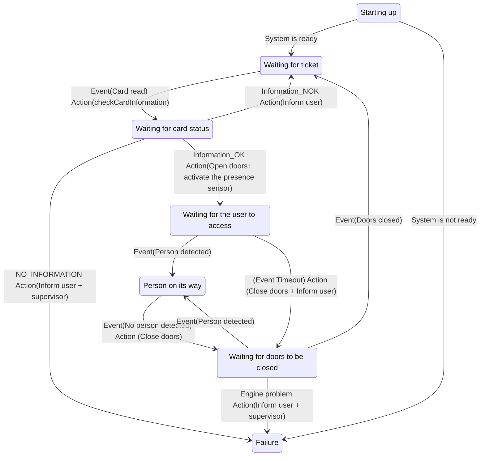

# Our system

## Components

- Doors
- Card sensor (Its gonna get information about the card "ID"... but we need to validate that information)
- Engine to open doors
- Presence sensor (sensor that sense someone passing through the doors)
- Network connectivity
- Computer (CPU) / Software
- Display (LCD)

## Events of this system

- Doors opened
- Doors closed
- Card readed
- Person detected
- No person detected

## Actions

- checkCardInformation. 
  This action has to send a request to a server to check if the card is valid or not (COMMUNICATION WITH THE CENTRAL SYSTEM) 
  Should that communication be synchronous or asynchronous?
    Sync: The system is waiting for the response of the central system
  May return:
  - Information_OK: If the pass is valid
  - Information_NOK: If the pass is not valid
  - NO_INFORMATION: If there is a problem with the central system
     ---> TIMEOUT: If the server is not responding in a certain amount of time... then I will mark the response of this action as NO_INFORMATION
- openDoors
- closeDoors
- systemReady
  
## States of this system

When defining states in a state machine, the names of the states should be nouns, whether the transitions should be verbs.

    |          |
    |          |    XX : Card sensor/reader
    +----|o----+    oo : Presence sensor     KISS: Keep it simple stupid
         |
         |      
    +----|o----+
    | X        |
    | X        |

## How are we going to deal with that presence sensor? TRICKY PART of this example (Is the same kind of sensor we will use in the elevator doors)

- When are we going to turn on / off the presence sensor?
  The presence sensor shall be deactivated when the door is completely closed 
  It MUST be active before doors start to open
   or once the doors are completely opened.. In this case we would have a problem: If the guy is fast and goes through the doors before they are completely opened, the presence sensor will not detect him.
- What information are we going to read from that sensor?
  - Presence
  - No presence
  - No information -> The sensor is not working properly -> Open doors
- How are we going to deal with that sensor?
- We should read the sensor every 100ms. Case we don't read the sensor in 100ms, we will consider that the sensor is not working properly and we will open the doors.

At this point we can make this system as much complex as we want.
For example, we could have a failure status for the presence sensor.
In this case, we may decide to keep trying to read the sensor for a certain amount of time... maybe the sensor starts working again.
Or at least to inform the technician that the sensor is not working properly.... and that is the reason why the doors are opened, and this machine is not working properly: FAILURE

We are writing a C program to deal with this. Once we receive that signal we will send/execute Interrupt Service Routine (ISR) to deal with that signal.
Event -> Information from the presence sensor -> Signal

In javaRT the minimun amount of information that can be stored in memory is 1 byte... or 8 byte.

    Interrupt Service Routine (ISR) -----> RAM : 2 bits ---> 00 READ_PRESENCE
                                                             01 READ_NO_PRESENCE
                                                             10 WAITING_FOR_INFORMATION < This value is set each time the consumer task reads the information

   Our interrupt routine is going to be executed each time the sensor sends a signal (the amount of time between signals will depend on the sensor)
   That should happen every 1ms or less
   This ISR will write the information in that region of memory (RAM) ... but it will only write 00 or 01

   We will create a task READ_PRESENCE_SENSOR_INFORMATION (which will run in a thread with certain priority) that will read the information of that region of memory.
   That task will be executed every 100ms (or whatever we decide) and will read the information of that region of memory.
   If the information is READ_PRESENCE, we will send an event to the state machine (Person detected)
   If the information is READ_NO_PRESENCE, we will send an event to the state machine (No person detected)
   If the information is WAITING_FOR_INFORMATION, we will send an event to the state machine (SENSOR FAILURE)
   And we will mark that region with value 10 again (WAITING_FOR_INFORMATION)

How many events do we want to keep in memory... till we read them and process them?
Do we want to store just the latest value? or do we want to store the last 10 values? Do we need a queue?
We just need the latest value. 

    This 100ms value... is going to depend on the speed of the doors. If the doors are fast... we may need to read the sensor every 50ms or more.

We have to make sure that this task READ_PRESENCE_SENSOR_INFORMATION is executed each 100ms
How can we do that? What do we need here?
    - A system clock
    - To define an interval who triggers the execution of that task each 100ms
        That means we need a programming language that allows us to define that interval... Almost any programming language will allow us to do that.
            From C, C++, Java, Python, Javascript, ADA, etc. 
    - Would this system work in Windows 10? Maybe... for sure not always. 
      Windows is not a real time operating system. It is not deterministic. It is not going to guarantee that the task will be executed each 100ms. It will depend on the load of the system. If the system is busy... it may take more than 100ms to execute that task.
    - MacOS? Same shit as Windows
    - Linux OS? Depending on the OS

## Scenario 1:

I am closing the doors
Imagine the sensor says there is presence at T0
If I process that information... I would reopen the doors
But I didn't
Then, at T1, the sensor says there is no presence
At that time.. I read the sensor information... is T0 information still valid? NO
I just want the latest information
I should have opened the doors at T0... but I didn't and I cannot change the past
The point is that right now I don't have presence... so I should keep closing the doors

## Interrupt Service Routine ?

Is a piece of code that is executed when an interrupt is received.... if there is any other thing that is being executed, it will be stopped and the ISR will be executed.

What do we need to take into consideration when we are writing an ISR?
It must be as short as possible. If we can just set a value in memory... that would be ok.
We don't want to be executing a lot of code in the ISR.... because we don't want to stop the execution of the main program for a long time.

---

Do we need a mutex in our case... or something similar?

        SAME RAM REGION (2 bits)
ISR  -> 00
        01
Task <-
     -> 10

If we implement something like a mutex in this case, that could lead to a Priority inversion problem.
Actually, in this case, we don't need a mutex... nor a semaphore... nor anything similar.
We are not doing any king of parallelism here.
If the ISR takes control... it's gonna interrupt the task... and the task will be executed once the ISR finishes.
These writes and reads are atomic operations... so we don't need to worry about that.

And we should try to design our system in a way that we don't need to use mutexes, semaphores, etc. when working with interrupts.
---

# Linux

## What is Linux?

Linux is not an OS. It is a kernel. 
A kernel is the core of an OS.
Every single OS has a kernel.

Windows too.
Microsoft have had 2 kernels: Windows NT and DOS
DOS Kernel was used to run Windows 3.1, Windows 95, Windows 98, Windows ME
NT Kernel was used to run Windows NT, Windows 2000, Windows XP, Windows Vista, Windows 7, Windows 8, Windows 10, Windows Server 2003, Windows Server 2008, Windows Server 2012, Windows Server 2016, Windows Server 2019

But an OS is not just a kernel. It is a kernel + a lot of other things. For example:
- A GUI (Graphical User Interface)
- A file system
- A network stack
- A lot of drivers
- A lot of applications
- A lot of services
- A lot of libraries

Linux is just a kernel. It is not an OS. Actually, Linus is the most used OS kernel in the world.

There are a number of OS that use Linux as a kernel:
- GNU/Linux. This is an OS which is distributed by a lot of different companies. Each company or organization add its own software on top of that OS:
  For example: Ubuntu, Debian, RedHat, Fedora, Suse, etc. Are all GNU/Linux OS.
- Android. Android is an OS that uses Linux as a kernel. But it is not GNU/Linux. 
    Android itself makes Linux the most used OS Kernel in the world.

The point here is that an OS does a bunch of things.
If we use a user oriented OS, we will have a lot of things that we don't need for an application like the one we are developing.
We don't want auto-updates, we don't want a GUI, we don't want a lot of drivers, we don't want a lot of services, we don't want a lot of applications, we don't want a lot of libraries, etc.
We may not want to make use of swapping

In contrast, we need to make sure that we have free resources whenever we need them.
And we need to make sure that we have a deterministic behavior:
- If we say that a task needs be executed each 100ms, we need to make sure that it will be executed each 100ms.

That's why for this kind of apps, we use a real time OS.
It is an OS... with less things than a user oriented OS... or a server oriented OS... but it had some special things that we need for this kind of apps:
- Deterministic behavior

# What is UNIX?

UNIX was an OS (created by the people at Bell Labs (AT&T)) that was created in the 70s.
They actually were trying to create an OS called MULTICS... but they failed.
And one of the guys that was working on that project, decided to create a new OS that originally was called UNICS (UNiplexed Information and Computing Service)... The point is that this name in english sounds like EUNUCHS... so they decided to change the name to UNIX.
The latest version of UNIX was released in 1993.

Nowadays UNIX is not an OS anymore. It is a specification of how to create an OS. Actually it consist of 2 specifications:
- Single UNIX Specification (SUS)
- POSIX (Portable Operating System Interface)

Nowadays the Unix trademark is owned by The Open Group.

Hardware manufacturers they produce their own OS for their special computers. For example:
HP: HP-UX, which is a certified UNIX OS
IBM: AIX, which is a certified UNIX OS
Oracle: Solaris, which is a certified UNIX OS
Apple: MacOS, which is a certified UNIX OS (They got the BSD OS... they tweaked it a little bit and they got the UNIX certification... after paying a lot of money to The Open Group)

Time ago, there were people trying to design an OS compatible with the UNIX specifications.
For example:
- People from the Berkeley University created BSD (Berkeley Software Distribution). This was an OS that was compatible with the UNIX specifications.
  They did it wrong. They said that they have a Unix compliant OS... but they didn't pay the license to AT&T. So, they were sued by AT&T and they were not able to distribute their OS anymore.
- People from GNU, they also tried to create a UNIX compliant OS. They did it right. They called that OS: GNU
  GNU means: GNU is Not UNIX .... People from AT&T don't sue us. We are not saying that we are UNIX. We are saying that we are not UNIX.
  We may look like UNIX, we may behave like UNIX, but we are not UNIX.
  The problem here is that they were not able to complete that OS....
  They created a bunch oof things that are part of an OS... 
  - A GUI: Gnome, 
  - a file system: ext4, 
  - a text editor: gnome, emacs
  - a game: GNU Chess
  They were not able to create a kernel. They didn't have a kernel.
- At that time Linus Torvalds started to design a Unix compliant kernel: LINUX

People from GNU and Linus Torvalds decided to join forces and create an OS together: GNU / Linux

---
Zoom
Counter strike

Those are also real time applications.
And they work in Windows 10.
The point that the core tasks of those applications are executed in a thread with a high priority.... and they don't consume a lot of resources.
And we have a huge and powerful CPU that is able to execute a lot of tasks in parallel.
i3, i5, i7, i9, etc. those are huge cpus with a lot of cores... and cycles per second.
We will stick to a small cpu with 1 or 2 cores and a few cycles per second.... or an integrated circuit with a microcontroller.

The point is that for our project we don't need a huge CPU... we don't need a lot of cores... we don't need a lot of cycles per second.
And we don't want a huge cpu... because it consumes a lot of energy... and it costs a lot of money.

As you kno... when playing a game one thing is all the calculations that are done in the CPU... but there is another thing that is the rendering of the graphics... and that is done by the GPU.
Depending on the GPU you have, you will have a better or worse experience playing a game.... a better or worst rendering of the graphics.