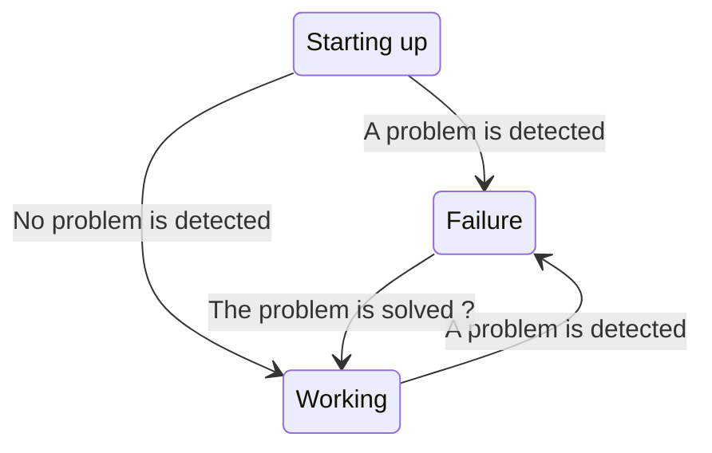
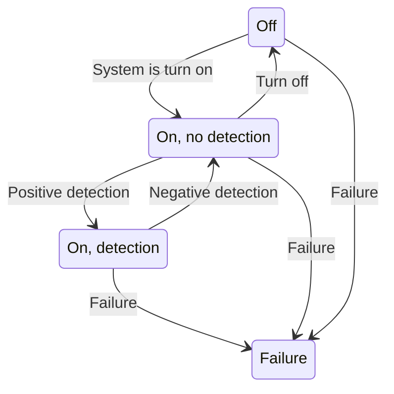
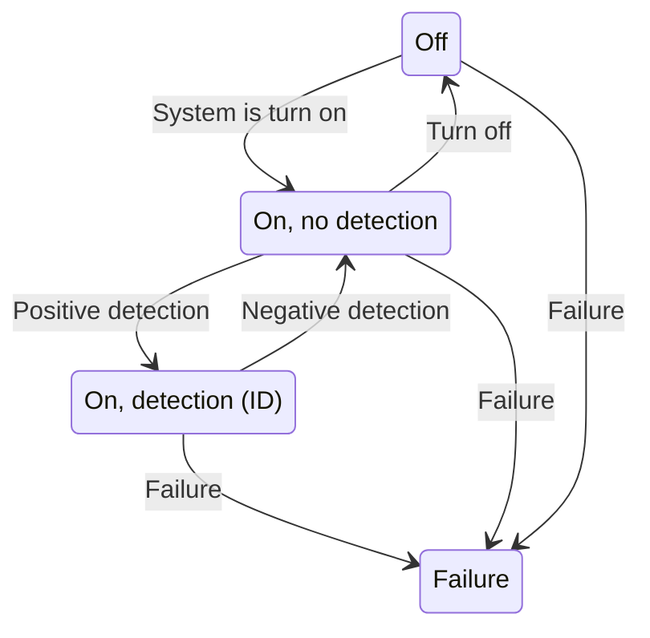
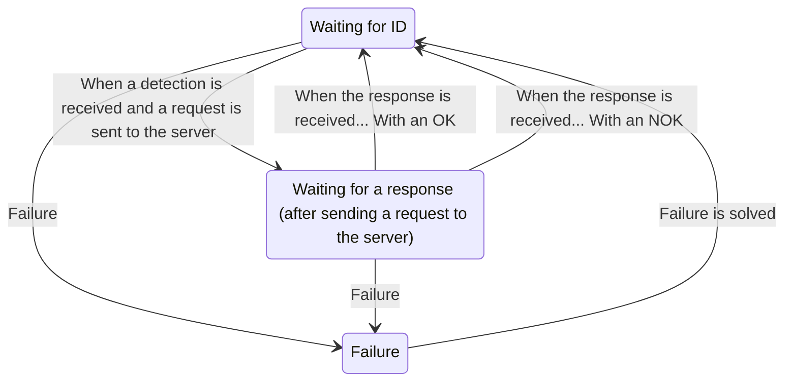
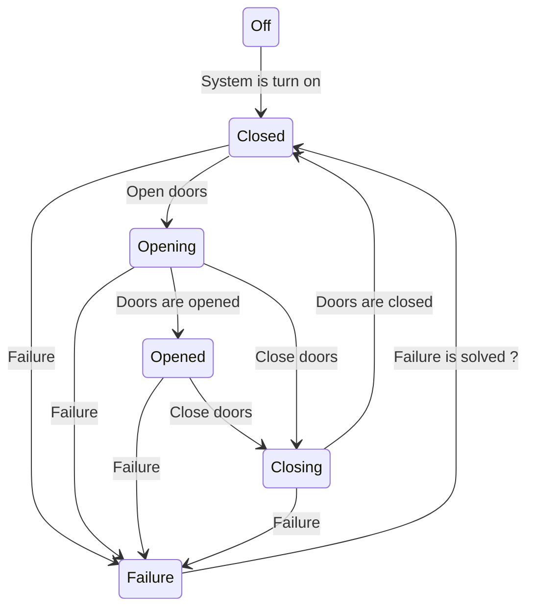
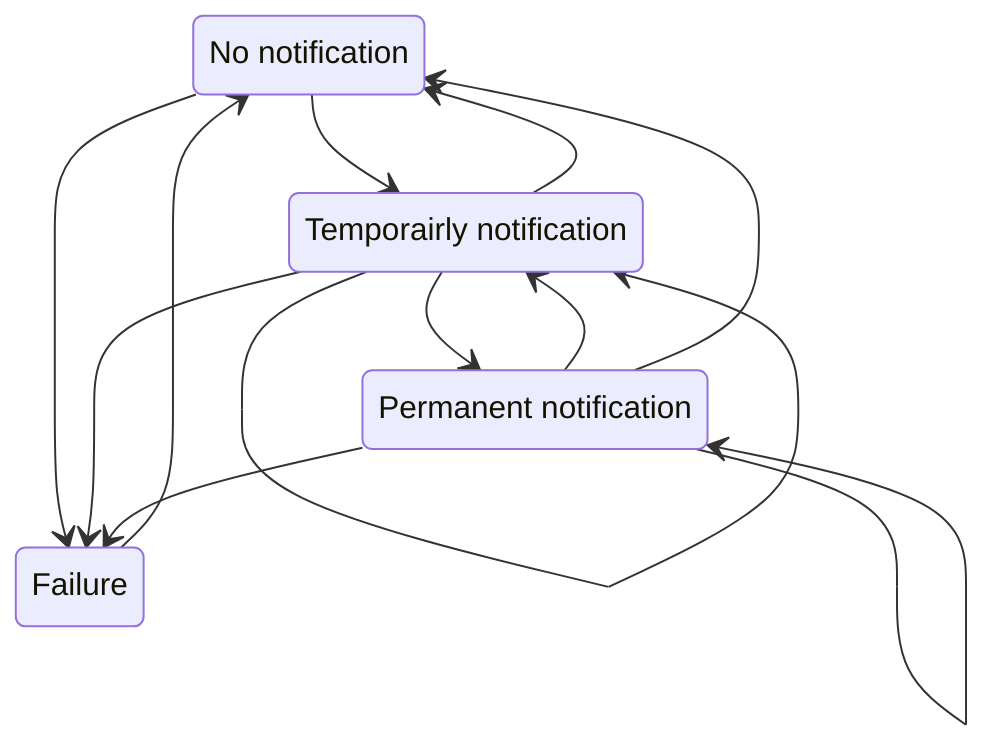

# Our system

## Components

- Doors
- Card sensor (Its gonna get information about the card "ID"... but we need to validate that information)
- Engine to open doors
- Presence sensor (sensor that sense someone passing through the doors)
- Network connectivity
- Computer (CPU) / Software
- Display (LCD)

## Events of this system

- Doors opened
- Doors closed
- Card readed
- Person detected
- No person detected

## Actions

- checkCardInformation. 
  This action has to send a request to a server to check if the card is valid or not (COMMUNICATION WITH THE CENTRAL SYSTEM) 
  Should that communication be synchronous or asynchronous?
    Sync: The system is waiting for the response of the central system
  May return:
  - Information_OK: If the pass is valid
  - Information_NOK: If the pass is not valid
  - NO_INFORMATION: If there is a problem with the central system
     ---> TIMEOUT: If the server is not responding in a certain amount of time... then I will mark the response of this action as NO_INFORMATION
- openDoors
- closeDoors
- systemReady
  
## States of this system

When defining states in a state machine, the names of the states should be nouns, whether the transitions should be verbs.

    |          |
    |          |    XX : Card sensor/reader
    +----|o----+    oo : Presence sensor     KISS: Keep it simple stupid
         |
         |      
    +----|o----+
    | X        |
    | X        |

## Subsystem. Presence detection process

## Subsystem. Card detection process

## Subsystem. Card validation process

In version 1 of our system we were using a synchronous communication with the central system... using REST protocol (HTTP)

In version 2 of our system we were using a synchronous communication with the central system... using SOAP protocol (HTTP)

## Subsystem. Doors operation process

## Subsystem. Notification process

# Signals

Are a way to communicate processes. 
That kind of communication is asynchronous.
POSIX defines signals as a way to communicate asynchronous events to a process or thread.
And actually POSIX defines RT signals and non-RT signals.

## Can you see any advantage of designing a system with multiple processes instead of a single process?

When working with multiple process we can focus on a single task, and we can reuse that process in other systems.
We will have not a HUGE SYSTEM with a lot of code, but we will have a lot of small systems that are easier to understand and to maintain.
We will just need to communicate those processes / systems.

----

SYSTEM: 
    When the main system arrives to state: ON
    We should start the subsystems:
        - Presence detection process
        - Card validation process
        - Doors operation process
        - Notification process
        - Card detection process

Card detection process:
    When this process arrives to state: ON_POSITIVE
       - SEND AN EVENT: "NEW ID" -> We have an ID (SIGNAL, byte in shared memory, ...)
         And we will have different process listening to that event:
            - Card validation process: NEW ID: 
                WAITING_FOR_ID ---> request ---> WAITING_FOR_ANSWER
                WAITING_FOR_ANSWER ---> request ---> WAITING_FOR_ANSWER ? OPTION
                We will ignore that event.... because we are waiting for a response
                FAILURE: Failure ... We will ignore that event

Card validation process:
    When this process arrives to state: WAITING_FOR_ANSWER
       - SEND AN EVENT: "WAITING_FOR_TICKER_VALIDATION" -> We have an ID (SIGNAL, byte in shared memory, ...)
            - Notification process
                NO_NOTIFICATION --> PERMANENT_NOTIFICATION
                TEMPORAIRLY_NOTIFICATION --> PERMANENT_NOTIFICATION
                PERMANENT_NOTIFICATION --> PERMANENT_NOTIFICATION
    How many displays do we have in this machine? Only 1? 2? 10? We don't care... We just sent and event... to whoever is listening to that event

    When this process arrives to state: WAITING_FOR_ID: When the response is received... With an OK
         - SEND AN EVENT: "VALIDATION_OK" -> We have an ID (SIGNAL, byte in shared memory, ...)
                - Doors operation process
                    CLOSED --> OPENING

Doors operation process
     When this process arrives to state: OPENING
        - SEND AN EVENT: OPENING_DOORS
            - Presence detection process
                OFF --> ON_NEGATIVE

In this way we won't have a hge system with a number of tightly coupled components... but we will have a lot of small systems that are easier to understand and to maintain, joined by events.
We have to INTEGRATE those systems... and we will do that using events / calls / signals / ...          API

Amazing things about this approach is that:
- we can reuse those small systems in other systems... because they are not tightly coupled to the main system.
- we can TEST those small systems in ISOLATION... as they are not tightly coupled to the main system.

---

# TESTING

## Vocabulary

- ERROR:        Humans we make errors (because we are tired... we are lack of knowledge... we are not focused... we are not paying attention... we are not motivated... we are not trained... we are not skilled... we are not experienced... we are not smart... we are not intelligent... we are not perfect... we are not machines... we are not robots... )
- BUG/DEFECT    When we make an error... we introduce a bug/DEFECT in the system
- FAILURE       That bug/defect can cause a failure when running the system

## What kind of test do you know?

## Kind of tests

We classify tests in different ways:

## Depending on the subject we are testing

- Functional tests          The are focused on the functionality of the system / component
- Non-functional tests      The are focused on the non-functional aspects of the system / component
  - Performance tests
  - Security tests
  - Usability tests
  - Stress tests
  - Load tests

## Depending on the scope of the test

- Unit tests            Unit test are focus on a single feature of an ISOLATED component of the system
                        For sure... the fact that each component works properly when it is isolated... doesn't mean that the system will work properly when all the components are integrated.
- Integration tests     Integration tests focus on the COMMUNICATION between 2 components (SIGNALS... SHARED MEMORY... API CALLS... )
                        For sure... the fact that each component works properly when it is integrated with another component... doesn't mean that the system will work properly when all the components are integrated.
- End to end tests      End to end test focus on the BEHAVIOR of the system as a whole
- Acceptance tests      Usually acceptance tests are end to end tests... but they are focused on the requirements of the system...
                        This is a subset of the previous test... the ones that the client is interested in.

Imagine I want to design this system... that we are working on.
Are we going to manufacture the doors engine? Probably not... 
   We will get that engine from a third party... and we will integrate it in our system.
   But before integrating it in our system... we will test it... to make sure that the engine works properly: UNIT TEST
   But... the thing here is that probably the manufacturer of the engine... has already done the exact same test ... that I am doing...
   ... For them... what king of test is that test? END TO END TEST

[- Component tests]

## Depending on the kwowledge of the system

- White box tests       We know the internals of the system/Component
- Black box tests       We don't know the internals of the system/Component

## Depending on the way we run the test

- Static tests          We don't run the system/Component
    - Any review process
      - Code review
      - Design review
   What does this kind of test help us to detect?  DEFECTS / BUGS
- Dynamic tests         We run the system/Component
   What does this kind of test help us to detect?  FAILURES 
   Once a failure is detected... we have to identify the DEFECT / BUG that is causing that failure... To fix it... and to avoid that failure in the future.
   That process is called DEBUGGING

## Additional classifications

- Smoke tests
- Regression tests
