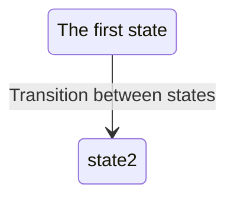

Markdown is a really simple syntax that allow us to write documents in a simple way. 
It's used in many places, like GitHub, StackOverflow, etc.
With just a small set of chars we can write styled documents, that can be converted to HTML, PDF, etc.

# Headers

I can actually define several levels of headers:

# Header 1 (this is what in Microsoft Word is called: Title 1)
## Header 2
### Header 3
#### Header 4
##### Header 5
###### Header 6

## Lists

### Unordered lists

- Item 1
- Item 2
- Item 3
  + Item 3.1 ( to create a sublist just add 2 spaces before the item)
  + Item 3.2

Actually you can use the dash ('-'), the asterisk ('*') or the plus ('+') to create an unordered list.

### Ordered lists

1. Item 1
2. Item 2
3. Item 3
   1. Item 3.1 ( to create a sublist just add 3 spaces before the item)
   2. Item 3.2

You can mix ordered and unordered lists.

## Tables

| Column 1 | Column 2 | Column 3 |
| -------- | -------: | :------: |
| Item 1   |   Item 2 |  Item 3  |
| Item 4   |   Item 5 |  Item 6  |

## Text styles

- This is an *italic* text
- This is a **bold** text
- This is a ***bold and italic*** text
- This is a ~~strikethrough~~ text
- This is a `monospaced` text. We usually make use of this syntax to write code snippets, var names, etc.

Also you can write blocks of code:

```c
int main(int argc, char *argv[]) {
  printf("Hello world!\n");
  return 0;
}
```

## There is an special language that we can make use of for creating diagrams

